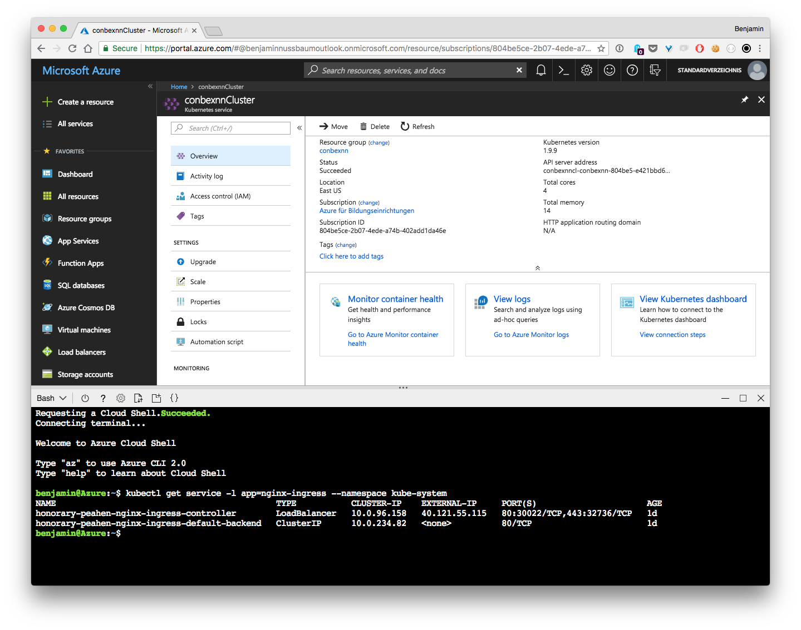

# Setting up in Azure (AKS)
## Prerequisites
- Azure Account
- Azure Cloud Shell

## Set up

Login into Azure Portal and open Cloud Shell

### Create cluster
```
az group create --name conbexnn --location eastus
az aks create --resource-group conbexnn --name conbexnnCluster --node-count 2 --enable-addons monitoring --generate-ssh-keys
```

### Configure kubectl

```
az aks get-credentials --resource-group conbexnn --name conbexnnCluster
```

### Setup Services

#### Checkout Git Repo

Checkout the repo containing the config files

```
git clone https://github.com/a00908270/conbexnn.git
cd deploy/cloud/azure 
```

#### Setup Services

```
kubectl apply -f mongo_small.yaml
kubectl apply -f vinnsl-service.yaml
kubectl apply -f vinnsl-nn-ui.yaml
kubectl apply -f mongo-storage-service_small.yaml 
kubectl apply -f vinnsl-storage-service.yaml
kubectl apply -f vinnsl-nn-worker.yaml
```

### Enable Service Discovery with Ingress
```
helm init
helm install stable/nginx-ingress --namespace kube-system 
kubectl apply -f ingress.yaml
```

## Usage



After a few minutes you can open the cluster ingress load balancer ip address to view the Vinnsl-NN-UI
You can get the "EXTERNAL-IP" by executing

```
kubectl get service -l app=nginx-ingress --namespace kube-system
```

After successful setup should be able to open the following endpoints in your browser:

https://ip-address/#/ + endpoint

| endpoint        | Service                           |
| --------------- | --------------------------------- |
| /#/             | Vinnsl NN UI                      |
| /vinnsl         | Vinnsl Service                    |
| /status         | Vinnsl NN Status                  |
| /worker/queue   | Worker Queue                      |
| /storage        | Storage Service                   |
| /train/overview | DL4J Training UI (while training) |

## Additional Information

### Enable Kubernetes Dashboard

(Not possible via Cloud Shell. You must setup `az` cli on your local machine.) 

```
kubectl create clusterrolebinding kubernetes-dashboard --clusterrole=cluster-admin --serviceaccount=kube-system:kubernetes-dashboard
#open kubernetes dashboard
az aks browse --resource-group conbexnn --name conbexnnCluster
```

